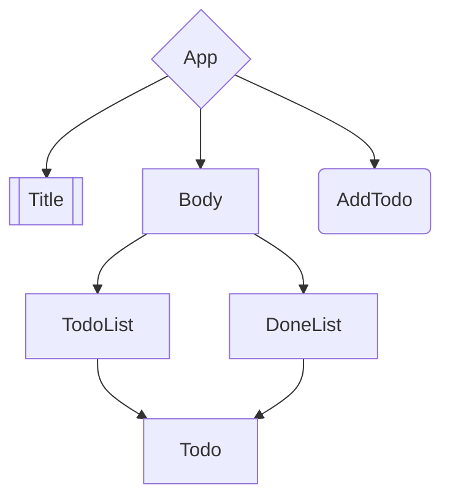

# LearnVue

# 初识Vue

1. 创建Vue实例，传入一个配置对象
    
    ```html
    <!-- root容器 Vue模板 -->
    <div id="example">
        <p>{{ message }}</p>
    </div>
    ```
    
    ```jsx
    // Vue实例
    new Vue({
        el: '#example', //CSS选择器 el:element
        data: {
            message: "kaikai"
        }
    })
    ```
    
2. Vue实例和Vue容器时一一对应的，既不能一对多，也不能多对一
3. `{{ xxx }}`中的xxx要写js表达式，**且xxx可以自动读取到Vue实例中data的属性**
4. 一旦data中的数据发生改变，页面中使用到的该数据会自动更新
5. Vue模板语句
    - `{{ xxx }}` 插值语句: 用于解析标签体内容
    - `v-xx:attribute="xxx"` 指令语句: 用于解析标签
        - `v-bind`: 单向绑定 把xxx这个JS表达式的结果绑定给attribute
            - 数据只能从data**流向**页面，即修改data中的值会影响页面中的值，反之不行
            - `v-bind:` 简写形式 `:`
            
            ```html
            <div id="root">
                <a v-bind:href="baidu.url">{{ baidu.name }}</a>
                <a :href="bilibili.url">{{ bilibili.name }}</a>
            </div>
            ```
            
            ```jsx
            new Vue({
                el: '#root',
                data: {
                    baidu: {
                        url: 'https://www.baidu.com',
                        name: '百度'
                    },
                    bilibili: {
                        url: 'https://www.bilibili.com',
                        name: '哔哩哔哩'
                    }
                }
            })
            ```
            
        - `v-model`: 双向绑定
            - 数据可以双向流动，既可以从data流向页面，也可以从页面流向data
            - 只能用于有`value`属性的表单类元素(`input`, `select`)
            - `v-model:value` 可简写为 `v-model`
6. 建立Vue实例与root容器(Vue模板)之间的联系(el的两种写法)
    - Vue模板由Vue实例解析
    - Vue实例将解析完的内容挂载到模板中的指定位置
    - 实例化Vue时建立联系
        
        ```jsx
        new Vue({
            el: '#root',
        })
        ```
        
    - 实例化之后再建立联系
        
        ```jsx
        const v = new Vue({})
        v.$mount('#root ') //mount:挂载: v实例挂载到root容器（就是建立Vue实例与root容器之间的联系）
        ```
        
7. data的两种写法
    - 对象式
        
        ```jsx
        new Vue({
            el: '#root',
            data: {
                name: 'kaikai'
            }
        })
        ```
        
    - 函数式
        
        ```jsx
        new Vue({
            el: '#root',
            /* data: function(){
                return {
                    name: 'kaikai'
                }
            } */
            data(){
                console.log('@@@', this) //this式Vue实例对象
                return{
                    name: 'kaikai'
                }
            }
        })
        ```
        
8. Vue所管理的函数一定不能写成 `=>` 箭头函数
    - 写做箭头函数，函数体中this指的就不再是Vue实例
    
    ```jsx
    // 1.
    function(a,b){
        return a+b;
    }
    // 等价于
    (a,b)=>a+b
    // 2.
    function(x){
        return {key: x}
    }
    // 等价于
    x=>({key: x})
    // 3.
    function(){
        return 'hello';
    }
    // 等价于
    ()=> {
        return 'hello';
    }
    ```
    

[Vue教程](https://www.bilibili.com/video/BV1Zy4y1K7SH?p=10&spm_id_from=pageDriver&vd_source=64b55993247a0c1e3849a8546c3513b5)

1. MVVM模型:
    - M: 模型(Model), data中的数据 **数据模型**
    - V: 视图(View), 模板代码 **Vue模板**
    - VM: 视图模型(ViewModel) **Vue实例**
    
    > Vue这个前端框架所干的事，就是作为一个桥梁ViewModel(Vue实例))把Model(数据模型)中的数据解析到V(Vue模板)中
    > 
    
    > Model中的所有属性都会出现在ViewModel(Vue实例)身上
    > 
    
    > vm身上的所有属性 以及 Vue原型上的所有属性, 在View(Vue模板)中都可以直接使用
    > 

---

## 数据代理

`Object.defineProperty`

```jsx
let obj = {x: 100}
let obj2 = {y: 200}
Object.defineProperty(obj, 'y', {
    get(){
        return obj2.y;
    },
    set(value){
        obj2.y = value;
    }
})
```

> 上述代码中obj2的y属性由obj代理
> 

### Vue中的数据代理

> 通过vm对象来代理data对象中的属性 原理:
> 

```
> i. 通过`Object.defineProperty()`把data对象的所有属性添加到Vue中
> ii. 为每一个添加到vm上的属性都指定一个getter&setter，在getter&setter内部读写data中对应的属性
```

## 事件处理

1. 使用v-on:xxx or @xxx 绑定事件，xxx是事件名 xxx最好不要用箭头函数来代替 否则
2. 事件的回调需要配置在methods对象上，最终会在vm对象上
3. methods中的函数不能用箭头函数，否则this就不再是vm
4. methods中配置的函数，都是被Vue所管理的函数，this的指向是 vm 或 组件实例对象
5. @click=“demo” 和 @click=“demo($event)”效果一致，后者可以传参

### 事件修饰符

1. prevent: 阻止默认事件
2. stop: 阻止事件冒泡
3. once: 事件只触发一次
4. capture: 使用事件的捕获模式
5. self: 只有event.target是当前操作的元素时才触发事件
6. passive: 事件的默认行为立即执行，无需等待事件回调执行完毕

### 键盘事件

1. Vue中常用的按键别名
    - 回车 => enter
    - 删除 => delete（捕获’删除’和’退格’键）
    - 退出 => esc
    - 空格 => space
    - 换行 => tab
    - 上 => up
    - 下 => down
    - 左 => left
    - 右 => right
2. Vue未提供别名的按键，可以使用按键原始的key值(keyCode也可，但不推荐)去绑定 ```html
    
     `<input type='text' placeholder="按下键盘提示key&keyCode" @keydown='showInfo'>`
    
    ``` > 注意：驼峰命名要转为短横线命名(eg: CapsLock => caps-lock)
    
3. 系统修饰键(用法特殊)：ctrl, alt, shift, meta
    
    (1). 配合keyup：按下修饰键的同时按下其他键，释放其他键事件才会释放~~(在本地Chrome测试时并不需要)~~
    
    ```
     ```html
     <div id='root'>
         <input type='text' placeholder="按下键盘提示key&keyCode" @keyup.ctrl='showInfo'>
     </div>
     <script>
         const vm = new Vue({
             el : '#root',
             data: {
    
             },
             methods: {
                 showInfo(e){
                     console.log(e.key, e.keyCode);
                 }
             }
         })
     </script>
     ```
    ```
    
    (2). 配合keydown：正常触发事件
    
    (3). 自定义键名: Vue.config.keyCodes.自定义键名 = 键码
    
4. 连用
    - `@keyup.ctrl.i`:只有当同时按下ctrl与i且释放i时才会触发事件
    - `@click.stop.prevent`: 先阻止冒泡，后阻止默认事件的触发

## 计算属性

1. 要用的属性不存在，要通过已有的属性计算得来
2. 底层借助了Object.defineProperty方法提供的setter和getter
    
    ```tsx
    <script>
        const vm = new Vue({
            el : '#root',
            data: {
                firstName: 'Kaikai',
                lastName: 'Ji'
            },
            computed: {
                fullName:{
                    get(){
                        console.log("get");
                        return this.lastName + ' - ' + this.firstName;
                    },
                    set(value){
                        console.log("set");
                        let name = value.split('-');
                        this.lastName = name[0];
                        this.firstName = name[1];
                    }
                }
            }
        })
    </script>
    ```
    
3. get函数执行时机：
    - 初次读取时会执行一次
    - 当依赖的数据发生变化时会被再次调用
4. 优势：与methods相比，内部有缓存机制(服用)，效率更高，调用更方便
5. 计算属性最终会出现在vm这个Vue实例身上，直接读取调用即可
6. 如果计算属性要被修改，可以通过set函数去修改计算属性所依赖的数据
7. 只读不写可以简写：
    
    ```tsx
    <script>
        const vm = new Vue({
            el: '#root',
            data:{
                firstName: 'Kaikai',
                lastName: 'Ji'
            },
            computed:{
                fullName(){
                    return this.lastName + ' - ' + this.firstName
                }
            }
        })
    </script>
    ```
    

## 监视属性（侦听属性）

> 两种写法
> 
- 在定义Vue实例时添加监视属性
- Vue实例定义好之后添加监视属性
- 配置字段immediate为true，则立即执行（即初始化时便执行一次）

```jsx
const vm = new Vue({
    el: '#root',
    data: {
        isHot: true
    }
    watch:{
    // isHot:{
    //     immediate: true,
    //     handler(newValue, oldValue){
    //         console.log('isHot被修改了', newValue, oldValue);
    //     }
    // }
        isHot(newValue, oldValue){
            console.log("isHot被修改了", newValue, oldValue);
        }
    }
})
// vm.$watch('isHot', {
//     handler(newValue, oldValue){
//         console.log('isHot被修改了')
//     }
// })
```

> 监视多级结构某个属性的变化
> 

```jsx
new Vue({
    el: '#root',
    data: {
        number: {
            a: 1,
            b: 2
        }
    },
    watch: {
        'number.a':{ // 务必停用简写形式 number.a
            handler(){
                console.log('a被改变了')
            }
        }
    }
})
```

> 深度监视
> 
- 监视多级结构中所有属性的变化，即观察多层；
- 在watch中添加配置项`deep` ，值为`true`；
    
    ```jsx
    watch: {
        number: {
            deep: true,
            handler(){
                console.log('number改变了')
            }
        }
    }
    ```
    
- 若不加，默认为`false`, 则观察不到number中元素值的变化，即只能观察到1层。

## `computed`与`watch`之间的区别

1. computed能完成的功能，watch都能完成
2. watch能完成的工作，computed不一定能完成，例如:watch可以进行异步操作

### 两个重要的原则

1. 所有的**Vue管理的函数**，最好写成**普通函数**，这样this的指向才是vm或组件实例对象
2. 所有***不被Vue所管理的函数***（定时器的回调函数，ajax的回调函数，Promise的回调函数等），最好写成***箭头函数***，这样this的指向才是vm或组件实例对象

## 绑定样式

### class 样式 & style 样式

1. 字符串写法：适用于：样式的类名不确定，需要动态指定
2. 对象写法：适用于：要绑定的样式个数确定，名字确定，但是要动态决定用不用
    - `:style="{fontSize: xxx}"` 其中xxx是动态值
3. 数组写法：适用于：要绑定的样式个数不确定，名字也不确定
    - `:style="[a, b]"` 其中a，b是样式对象

```html
<div class="basic" :class="mood" @click="changeMood" :style="styleObj">{{ name }}</div> <br/><br/><div class="basic" :class="classArr" :style="{color: fcolor}">{{ name }}</div> <br/><br/><div class="basic" :class="classObj" :style="styleArr">{{ name }}</div>
<br/><br/>
```

```jsx
const vm = new Vue({
    el: '#root',
    data: {
        name: 'kaikai',
        mood: 'normal',
        classArr: ['a', 'b', 'c'],
        classObj: {
            a: true,
            b: true,
            c: true
        },
        fcolor: 'red',
        styleArr: [
            {
                color: 'orange'
            },
            {
                fontSize: '50px'
            }
        ],
        styleObj: {
            color: 'blue',
            fontSize: '60px'
        }
    },
    methods: {
        changeMood(){
            const x = 3 * Math.random();
            console.log(x);
            this.mood = ['happy', 'sad', 'normal'][Math.floor(x)];
        }
    },
})
```

## 条件渲染

> v-show: 是否显示 true or false or 表达式（可转为bool值）
> 
> 
> 底层：`display` 属性设置为 `none` 来隐藏元素
> 
> 适用于切换频率较高的场景
> 

> v-if & v-else-if & v-else : 是否显示元素
> 
> 
> 底层: 元素是否存在，不展示的DOM元素直接移除
> 
> 可以与`<template>`元素联合使用，该元素不会破坏DOM结构
> 
> 适用于切换频率较低的场景
> 

## 列表渲染

> v-for 指令
> 
> 
> 用于展示列表数据
> 
> 语法: `v-for="(item, index) in xxx" :key="yyy"`
> 
> `v-for="(value, key) in xxx" :key="yyy"`
> 
> 可遍历: 数组，对象，字符串，指定次数
> 

```html
<h2>人员列表(遍历数组)</h2>
<ul>
    <li v-for="(value, index) in persons" :key="id">{{ index }}-{{ value }}</li>
</ul>
<h2>汽车信息(遍历对象)</h2>
<ul>
    <li v-for="(value, key) in car" :key="key">{{ key }}-{{ value }}</li>
</ul>
<h2>测试遍历字符串</h2>
<ul>
    <li v-for="(value, index) in str" :key="index">{{index}}-{{value}}</li>
</ul>
<h2>测试遍历指定次数</h2>
<ul>
    <li v-for="(number, index) in 5" :key="index">{{ index }}-{{ number }}</li>
</ul>
```

## key 的原理

1. 虚拟DOM中key的作用:
    - key是虚拟DOM对象的标识，当数据发生变化时，Vue会根据**新数据**生成**新的虚拟DOM**
    - Vue进行**新虚拟DOM**与**旧虚拟DOM**的差异比较，比较规则如下:
2. 对比规则:
    - 旧虚拟DOM中找到了与新虚拟DOM相同的key:
        - 若虚拟DOM中的内容没变，直接使用之前的真实DOM
        - 若虚拟DOM中的内容变了，则生成新的真实DOM，随后替换掉页面中之前的真实DOM
    - 旧虚拟DOM中未找到与新虚拟DOM相同的key:
        - 创建新的真实DOM，随后渲染到页面
3. 用index作为key(默认)可能引发的问题:
    - 若对数据进行: 逆序添加，逆序删除等破坏顺序的操作:
        - 会产生没有必要的真实DOM更新 —> 界面效果没问题，但效率低
    - 如果结构中还包括输入类的DOM:
        - 会产生错误DOM更新 —> 界面有问题
        - 因为纵使输入类的真实DOM不同(比如说value值不同)，他们的虚拟DOM仍是相同的
4. 开发中key的选择:
    - 最好使用数据的唯一标识作为key
    - 如果不存在破坏顺序的操作，使用index作为key也是没有问题的

## 列表过滤

1. 用watch实现  

```jsx
watch:{
 keyWord: { 
	immediate: true, 
	handler(newValue, oldValue){ 
	this.filPersons = this.persons.filter((person)=>{
	 return person.name.indexOf(this.keyWord) !== -1;
	 })
	}
 }
}
```

1. 用computed实现 

```jsx
computed: {
 filPersons(){
 console.log(this);
 return this.persons.filter((person)=>{
 console.log("=>", this);
 return person.name.indexOf(this.keyWord) !== -1 })
 }
}
```

## 列表排序

> Array.prototype.sort() 原数组原地排序，并不进行复制
> 
> 
> 默认排序顺序是在将元素转换为字符串，然后比较它们的 UTF-16 代码单元值序列时构建的
> 
> `arr.sort([compareFunction])`
> 
> `compareFunction(a, b)`
> 
> 小于0，a被排在b之前
> 
> 大于0，a被排在b之后
> 
> 等于0，a，b位置不变
> 
> `Array.prototype.map()`
> 
> map() 方法创建一个新数组，这个新数组由原数组中的每个元素都调用一次提供的函数后的返回值组成。
> 

```jsx
computed: {
    filPersons(){
        const arr = this.persons.filter((person)=>{
            return person.name.indexOf(this.keyWord) !== -1
        });
        // 判断是否需要排序
        if(this.sortType){
            arr.sort((p1, p2)=>{
                return this.sortType === 1 ? p1.age - p2.age : p2.age - p1.age;
            });
        }
        return arr
    }
},
```

## 监测数据改变的原理

### Vue监测对象中数据的改变

1. 数据加工（劫持）
    - 数据代理: 当数据发生改变时，**重新解析模板**（解析模板之后生成虚拟DOM，新旧虚拟DOM对比，更新页面）；
    - 这里的getter和setter是reactiveGetter和reactiveSetter，即响应式的getter和setter；
    - 加工后data成为了一个Observer对象，监测的正是对象中数据的改变，一旦数据改变reactiveSetter就会去重新解析模板。
2. vm._data = data
3. Vue.set(target, key, val)&vm.$set(target, key, val)
    - 向vue追加响应式的数据
    - 为什么vm.xx和vm._data.xx不行？
        - 因为vm.xx是对vm._data.xx做的数据代理
        - 而通过vm._data.xx添加数据时，Vue并不会为xx添加reactiveGetter和reactiveSetter，故只是添加了数据，而没有与模板建立联系，显然是无法渲染到页面当中的。
    - 注意target不能是Vue实例，或者Vue实例的根数据对象，即不能直接往data里添加新的property，而可以向data中的Object/Array里添加property。

### Vue检测数组中数据的改变

1. Vue并没有为数组中的元素添加reactiveGetter和reactiveSetter, 因此直接通过vm.xx[x]/vm._data.xx[x]来修改元素是不会触发模板的重新解析的，自然不会更新页面。
2. Vue对数组的变更方法做了封装，使得其能够在变更数组之后重新解析模板，从而更新页面，有以下7中方法:
    - push(): 追加一个元素
    - pop(): 删除最后一个元素
    - shift(): 删除第一个元素
    - unshift(): 开头增加一个元素
    - splice(): 指定位置插入,删除,替换元素
    - sort(): 排序
    - reverse(): 反转数组
3. Vue.set(target, key, val)&vm.$set(target, key, val)两个方法也可以在为数组添加元素之后重新解析模板。

## v-model收集表单中的数据

- `<input type="text"/>`, v-model收集的是value值, 用户输入的就是value值
- `<input type="radio"/>`, v-model收集的是value值, 且要给input元素设置value属性
- `<input type="checkbox"/>`
    1. 没有配置input的value属性, 那么收集的就是checked(勾选or未勾选, 是布尔值)
    2. 配置input的value属性:
        - v-model的初始值(vue配置项data中的对应字段)是非数组, 那么收集的就是checked
        - data中绑定的字段是数组, 那么收集的就是value组成的数组

 备注:

 v-model的三个修饰符 

lazy: input失去焦点vue再收集数据(更新data)  

number: 输入字符串转为有效数字 

trim: 过滤输入的首尾空格

## 过滤器

- 定义: 对要显示的数据进行特定格式化之后在显示(适用于一些简单逻辑的处理)
- 语法:
    - 注册过滤器:
        - Vue.filter(name, callback): 注册全局过滤器
        - new Vue{filters: {}}: 注册局部过滤器
    - 使用过滤器: {{ xxx | 过滤器名 }} 或 v-bind:属性 = “xxx|过滤器名”
- 备注:
    - 过滤器也可以接收额外参数，多个过滤器也可以串联
    - 并没有改变原本的数据结构，是产生新的对应的数据

> callback: 回调函数
> 
> 
> A “callback” is any function that is called by another function which takes the first function as a parameter. （在一个函数中调用被传入的函数就是回调，而这个被传入的函数就是回调函数）
> 

## 内置指令

| 指令 | 功能 |
| --- | --- |
| v-bind | 单向绑定解析表达式，`v-bind:xxx`可简写为`:xxx` |
| v-model | 双向数据绑定，绑定表单元素的value属性，`v-model:value`可简写为`v-model` |
| v-for | 遍历数组/对象/字符串/指定次数 |
| v-on | 绑定事件监听，v-on:xxx可简写为@xxx |
| v-if | 条件渲染（控制节点是否存在） |
| v-else-if | 条件渲染（控制节点是否存在） |
| v-else | 条件渲染（控制节点是否存在） |
| v-show | 条件渲染（控制节点是否展示） |
| v-text | 向其所在的节点中渲染文本内容，注意v-text中的内容会替换掉节点中的内容 |
| v-html | 支持结构的解析  |
| v-cloak | 一个没有值的特殊属性，Vue实例创建完毕并接管容器后，会删掉v-cloak属性 |
| v-once | 无值，v-once所在节点在初次动态渲染后，就视为静态内容了，以后数据的改变不会引起v-once所在结构的更新。 |
| v-pre | 跳过其所在节点的编译过程，可利用其跳过没有使用指令语法、插值语法的节点，会加快编译。 |

## 自定义指令

> 语法：                                                                                                                                              
1. 局部指令：函数式 `new Vue({directives: {指令名: 回调函数}})`
                      对象式 `new Vue({directives: {指令名: 配置对象}})`
2. 全局指令：函数式 `Vue.directive(指令名, 回调函数)`
                      对象式 `Vue.directive(指令名, 配置对象)`
注意事项：
1. 指令名定义时不加 `v-` ，使用时加
2. 指令名如果是多个单词，要使用*kebab-case*命名方式，不要用*camelCase*命名
> 

```html
<body>	
	<p v-big-number="n"></p>
	<input v-fbind:value="n">
	<button @click="n++">+1</button>
</body>
<script>
	new Vue({
		data: {
			n: 1
		},
		directives: {
			// 函数式: 执行时机:
			// 1. bind: 指令与元素成功绑定时(最初，此时已经解析出真实DOM，但还未插入页面)
			// 2. update: 指令所在模板被重新解析时
			'big-number'(element, binding){
				element.innerText = binding.value * 10
				console.log(this) // window
			},
			// 对象式:
			fbind: {
				// 指令与元素成功绑定时(最初，此时已经解析出真实DOM，但还未插入页面)
				bind(element, binding){
					element.value = binding.value
				},
				// 指令所在元素被插入页面时
				inserted(element, binding){
					element.focus()
				}
				// 指令所在的模板被重新解析时
				update(element, binding){
					element.value = binding.value
				}
			}
		}
	})
</script>
```

## 生命周期

> 概念理解：
> 
> 1. 又名：生命周期回调函数、生命周期函数、生命周期钩子
> 2. 是什么：Vue在关键时刻为我们调取的一些特殊名称的函数
> 3. 生命周期函数的名字不可更改，其内容由我们根据需求编写
> 4. 生命周期函数中的this指向vm或组件实例对象

| 函数名 | 调用时机 |
| --- | --- |
| 挂载 |  |
| beforeCreate | 事件和生命周期创建之后，数据检测和数据代理创建之前 |
| created | 数据检测和数据代理创建之后，模板编译（创建虚拟DOM）之前 |
| beforeMount | 模板编译（虚拟DOM创建）之后，真实DOM创建和挂载之前 |
| mounted | 真实DOM创建并挂载之后，至此页面才真正完成渲染，成为了一个正常的页面，初始化结束。 |
| 更新 | when data changes |
| beforeUpdate | 数据更新后，新虚拟DOM生成前，真实DOM更新前 |
| updated | 页面（真实DOM）更新后 |
| 销毁 | when vm.$destroy() is called |
| beforeDestroy | 销毁之前，能访问到数据和方法，但对数据的修改不会触发更新 |
| destroyed | 实例销毁之后 |

```jsx
new Vue({
	mounted() {
		/*
			初始化操作:
			1. 发送ajax请求
			2. 启动定时器
			3. 绑定自定义事件
			4. 订阅消息
			……
		*/
	},
	beforeDestroy() {
		/*
			收尾工作: 
			1. 清除定时器
			2. 解绑自定义事件
			3. 取消订阅消息
			……
		*/
	}
})
```

- 关于销毁Vue实例
    1. 销毁后借助Vue开发者工具开不到任何消息
    2. 销毁后自定义事件会失效，但是原生DOM事件仍然有效
    3. 一般不会在beforeDestroy操作数据，因为即使操作数据也不会再触发更新流程了


## 组件化编程

- 定义组件
    
    使用Vue.extend(options)创建组件，其中options和new Vue(options)时传入的那个options几乎一样，区别如下:
    
    1. el不能写 —— 组件由vm实例管理，vm实例中的el决定服务哪个容器
    2. data必须写成函数 —— 避免组件被复用时，数据存在引用关系
    
    `tips`: 
    
    1.  使用template配置项可以配置组件的结构
    2. const school = Vue.extend(options) ⇒ const school = options
- 注册组件
    1. 局部注册：`new Vue` 时传入 components配置项
    2. 全局注册：`Vue.component(’组件名’, 组件)`
    
    组件名：
    
    1. 一个单词组成：
        1. 首字母小写：school
        2. 首字母大写：School
    2. 多个单词组成：
        1. kebab-case命名：my-school
        2. CamelCase命名：MySchool（需要Vue脚手架支持）
    3. 备注：
        1. 组件名尽可能回避HTML中已有的元素名称（h2、H2）
        2. 可以使用name配置项指定组件在开发者工具中呈现的名字
- 使用组件
    
    编写组件标签：
    
    1. `<组件名></组件名>`
    2.  `<组件名/>`
    
    `tips`: 第二种写法只有在使用脚手架时才可使用
    

### VueComponent

```jsx
school = Vue.extend(
	name: "School"
	data(){
		name: 'XDU',
		location: 'Xian Shaanxi'
	}
	template: `
		<h2>{{ name }}</h2>
		<h2>{{ location }}</h2>
	`
)
```

关于VueComponent

1. school组件本质是一个VueComponent构造函数（由Vue.extend返回）
2. 使用 `<school/> 或 <school></school>` 标签时，会调用构造函数（ `new VueComponent`）来创建一个组件实例对象
3. 💢 每次调用 `Vue.extend()` 返回的都是一个全新的 `VueComponent` 构造函数
4. 关于 `this` 指向：
    1.  `Vue.extend(options)`组件配置中： `VueComponent`实例对象
    2. `new Vue(options)` 配置中： `Vue` 实例对象
5.  `Vue` 实例对象 简称 `vm` 
    
    `VueComponent` 实例对象 简称 `vc`
    

### 一个重要的内置关系

目的：让组件实例对象可以访问到Vue原型上的属性和方法

1. VueComponent.prototype.__ proto__ === Vue.prototype
2. 理解：组件（ `VueComponent`构造函数，即 `Vue.extend()`）的显式原型对象 的隐式原型对象 就是 Vue（ `Vue` 构造函数）的显示原型对象
3. 有这个关系的好处：
    
    让组件实例对象可以访问到Vue原型上的属性和方法
    

## 单文件组件

```jsx
// School.vue
<template>
	<!-- 组件的结构（需要一个根元素） -->
	<div class="demo">
	</div>
</template>

<script>
	// 组件交互相关的代码
	export default {
		name: 'School',
		data(){
			return {}
		},
		method: {
		
		}
	}
</script>
 
<style>
	/* 组件的样式 */
	.demo{
		background-color: orange;
	}
</style>
```

```jsx
// App.vue
<template>
	<School/>
</template>
<script>
	import School from './School'

	export default {
		name: "App",
		components: {
			School
		}
	}
</script>
```

```jsx
// main.js
import App from './App.vue'
new Vue({
	el: "#root",
	components: {
		App
	},
	template: `
		<App></App>
	`
})
```

```html
<!-- index.html -->
<!DOCTYPE html>
<html>
	<head>
		<meta charset="UTF-8">
		<title></title>
	</head>
	<body>
		<div id="root"></div>
		<script src="../js/vue.js"></script>
		<script src="./main.js"></script>
	</body>
</html>
```

- [x]  JavaScript 原型
- [x]  ES6 模块化 统一暴露 分别暴露 默认暴露

## ref属性

- 用途
    1. 给元素或子组件注册引用信息（代替html元素的id属性）
    2. 获取真实DOM元素（应用于html标签），组件实例对象（应用于组件标签）
- 使用
    1. 打标签： `<h1 ref="xxx"> or <School ref="xxx"></School>`
    2. 获取： `this.$refs.xxx`

## props配置项

- 功能
    
    让组件接收外部传过来的数据
    
- 传递数据
    
    为为组件标签添加属性
    
    `<Demo name="xxx">`
    
- 接收数据
    1. 单纯的接收
        
        `props: ['name']`
        
    2. 限制数据类型
        
        ```jsx
        props: {
        	name: String,
        	age: Number
        }
        ```
        
    3. 限制类型、限制必要性、指定默认值
        
        ```jsx
        props: {
        	name: {
        		type: String, // 类型
        		required: true, // 必要性
        		default: 'kaikai' // 默认值
        	}
        }
        ```
        
- 备注
    
    props是只读的，即属性值一旦传入就最好不要更改
    
    一旦更改，就会发出警告
    
    若必须更改，可复制props中的内容到data配置项中，去修改data中的数据
    

## mixin配置项

- 功能
    
    可以把多个组件公用的配置提取成一个混入对象
    
- 使用方式
    1. 定义混入
        
        ```jsx
        {
        	data() {···},
        	methods: {···}
        	···
        }
        ```
        
    2. 使用混入
        
        ```jsx
        1. 全局混入 main.js
        Vue.mixin(xxx)
        2. 局部混入 xx.vue
        minxins: ['xxx']
        ```
        

## 插件

功能：用于增强Vue，为Vue添加全局功能的工具代码

本质：包含install方法的一个对象，install方法第一个参数是Vue，第二个之后的参数是插件使用者传递的数据

```jsx
// plugins.js
// 定义插件 
// Vue2
export default {
	install(Vue, options){
		// 1. 添加全局过滤器
		Vue.filter()
		// 2. 添加全局指令
		Vue.directive()
		// 3. 配置全局混入
		Vue.mixin()
		// 3. 添加实例属性与方法
		Vue.prototype.$myMethod = function(){}
		Vue.prototype.$myProperty = xxx
	}
	// install: function(Vue, options){}
}
// Vue3
const myPlugin = {
	install(app, options) {
		// 配置此应用
	}
}
export default myPlugin
// or
// plugins/translate.js
export default {
	install: (app, options) => {
		// 配置: 编写插件代码
		// 一个翻译函数 可以被全局调用(添加到globalProperties)
		// 逐层索引以获取options对象的深层属性(如果确实有的话)
		app.config.globalProperties.$translate = (key) => {
			return key.split('.').reduce((o, i) => {
        if (o) return o[i]
      }, options)
		}

		// 使用provide函数将插件接收到的options提供给整个应用
		// 结果是：插件用户可以在任意组件中注入并访问插件的选项对象了
		app.provide('translate', options)
	}
}  
```

```jsx
// 使用插件
// Vue2
Vue.use()
// Vue3
import { createApp } from 'vue'
import tanslatePlugin from './plugins/translate'

const app = createApp({})

app.use(translatePlugin, {
	/* 可选项 */ 
	greetings: {
		hello: 'Bonjour!'
	}
})
```

```jsx
<template>
	<h1>{{ $translate('greetings.hello') }}</h1>
</template>
```

## scoped属性

作用：让样式在局部生效，避免冲突

写法： `<style scoped>`

## 项目构建

### Vue-cli

```bash
vue create project-name
```

### Vite

```bash
npm create vite@latest projectName [-- --template vue]

npm install

npm run dev
```

### src

```jsx
/src 目录下为源代码，是应该主要关注的地方
/src 同级文件 index.html 是根html文件 即我们要渲染的页面
/src/components 存放组件
/src/App Vue实例中的主组件

/src/main.js 创建Vue实例 将Vue实例挂载到目标元素
import { createApp } from 'vue'
import App from './App.vue'

createApp(App).mount('#app')
```

## 组件的自定义事件

<aside>
💢 一种组件间的通信方式：适用于 子组件 =⇒ 父组件 传递数据

</aside>

### 使用方式

- 父组件给子组件绑定事件
    
    ```jsx
    // Parent.vue
    <template>
    	// 1. 
    	// once修饰符 事件只触发一次
    	<Son @event.once="callback"/>
    	// native修饰符 绑定DOM原生事件
    	<Son @click.native="callback"/>
    	// 2.
    	<Son v-on:event="callback"/>
    	// 3. 
    	<Son ref="Son"/>
    </template>
    <javascript>
    	export default{
    		name: "Parent",
    		methods:{
    			callback(params){}
    		}
    		mounted(){
    			// 3. 这种方法的callback只能配置在methods中 或者是使用箭头函数
    			this.$ref.Son.$on(event, callback),
    			// 只触发一次
    			this.$ref.Son.$once(event, callback),
    		}
    	}
    </javascript>
    ```
    
- 子组件触发事件
    
    ```jsx
    // Son.vue
    <script>
    	export default {
    		emits: [strEventName1, strEventName2], // 显示声明组件要触发的事件
    		methods: {
    			emitEvent() {
    				this.$emit(strEventName1, params) // this指向Son event对应的回调函数中的this应指向Parent
    			}
    		}
    	}
    </script>
    <template>
    	<div>
    		<button @click="$emit(strEventName2, params)"></button>
    		<button @click="emitEvent"></button>
    	</div>
    </template>
    ```
    
- 子组件解绑事件
    
    ```jsx
    this.$off(event)
    ```
    
- 子组件校验事件
    
    ```jsx
    export default {
    	emits: {
    		// 没有校验
    		click: null,
    		// 校验submit事件 返回值为布尔值 表示校验成功或失败
    		submit: ({ email, password }) => {  // 入参是抛出事件时传入 this.$emit 的内容
    			if (email && password) {
    				return true
    			} else {
    				console.log('Invalid submit event payload!')
    				return false
    			}
    		}
    	},
    	methods: {
    		submitForm(email, password) {
    			this.$emit('submit', { email, password })
    		}
    	}
    }
    ```
    
- 配合 `v-model` 使用
    
    ```jsx
    // Dad.vue
    <template>
    	<CustomInput v-model="searchText"/>
      // 等价于
    	<CustomInput
    		:modelValue="searchText"
    		@update:modelvalue="newValue => searchText = newValue"
    	/>
    </template>
    ```
    
    在组件中实现 `v-model` 
    
    方案1： 
    
    ```html
    <!-- CustomInput.vue -->
    <script>
    export default {
    	props: ['modelValue'],
    	emits: ['update:modelValue']
    }
    </script>
    
    <tempalte>
    	<input
    		:value="modelValue"  <!-- 数据单项绑定 modelValue to value -->
    		@input="$emit('update:modelValue',  $event.target.value)" <!-- 数据更新 value to modelValue -->
    	/>
    </template>
    ```
    
    方案2：
    
    ```html
    <!-- CustomInput.vue -->
    <script>
    export default {
    	props: ['modelValue'],
    	emits: ['update: modelValue'],
    	computed: {
    		value: {
    			get() {
    				return this.modelValue
    			},
    			set(value) {
    				this.$emit('update:modelValue', value)
    			}
    		}
    	}
    }
    </script>
    
    <template>
    	<input v-model="value" />
    </template>
    ```
    
    [v-model](LearnVue%20ec77b16bdd8341ab895699689dd5649c.md)修饰符
    
    | .lazy | 延迟响应：默认v-model会在input事件后更新数据，加lazy修饰符后会在change事件后更新数据 |
    | --- | --- |
    | .number | 将用户输入自动转换为number，若无法转换则返回原始值，number修饰符在input元素的属性type为number时自动启用 |
    | .trim | 默认去除用户输入内容中两端的空格 |
    
    ```html
    <!-- 自定义组件修饰符 capitalize -->
    <!-- Dad.vue -->
    <template>
    	<MyComponent v-model.capitalize="myText"/>  <!-- v-model默认绑定 value 属性 -->
    </template>
    ```
    
    ```html
    <!-- MyComponent.vue -->
    <script>
    export default {
    	props: {
    		modelValue: String,
    		modelModifiers: {
    			default: () => ({})  // 默认值是一个空对象 即编写程序时并不需要编写这个prop
    		}
    	},
    	emits: ['update:modelValue'],
    	created() {
    		console.log(this.modelModifiers) // { capitalize: true } 由于调用组件时使用了capitalize修饰符
    	},
    	methods: {
    		emitValue(e) {
    			let value = e.target.value
    			if (this.modelModifiers.capitalize) {
    				value = value.charAt(0).toUpperCase() + value.slice(1)
    			}
    			this.$emit('update: modelValue', value)
    		}
    	}
    }
    </script>
    
    <template>
    	<input 
    		type="text"
    		:value="modelValue"  
    		@input="emitValue"
    	/>
    </template>
    ```
    
    对于有参数名arg及修饰符的v-model绑定，在组件中生成的props的key值是 `arg + 'Modifiers'`
    
    ```html
    <MyComponent v-model:title.capitalize="myText" />
    ```
    
    ```jsx
    export default {
    	props:" ['title', 'titleModifiers'],
    	emits: ['update:title']
    	created() {
    		console.log(this.titleModifiers) // { capitalize: true }
    	}
    }
    ```
    

## 全局事件总线

<aside>
💢 一种组件间通信的方式，适用于 任意组件间通信

</aside>

全局事件总线实际上就是通过已有的方法来实现不同组件间通信的方法，关键点在于如何实现相邻组件间的通信，即同级组件间的信息交互：

1. 首先明确的是，同级组件间无法直接通信，二者之间需要一个第三者来连接
2. 这个第三者需要满足一下两点条件
    1. A组件能够交给它信息
    2. B组件能够访问到信息
    
    即A B组件都能够与它产生交互（它在哪里？），且其拥有 `$emit $on $off` 方法（它是什么？）
    
3. 由于它需要具有绑定和触发事件的两个方法，所以他是vm或vc（其实无所谓，只要有这俩方法就行，关键是把它放在哪？）
4. 由于组件是实例对象，我们可以借助他们相同的原型对象来实现任意组件间的通信（即把它放在任意组件都可以访问到的原型对象上）：
    1. 首先实例对象是通过 `new` 关键字来实例化组件的原型对象的
    2. 其次由于组件原型对象是通过  `Vue.extend()` 返回的
    3. 所以说组件原型对象并不能作为我们使用的原型对象，因为不同组件的组件原型对象不同
    4. 但是由于组件原型对象的__prototype__属性所指向的是Vue原型对象，这个是相同的
    5. 所以说我们可以将第三者放到Vue原型对象上，一旦将第三者放到了Vue的原型对象上，原型链上的任意对象之间均可借助第三者实现通信

### 使用方式

- 安装全局事件总线
    
    ```jsx
    new Vue({
    	···
    	beforeCreate() {
    		Vue.prototype.$bus = this // 安装全局事件总线，$bus就是当前应用的vm
    	},
    	···
    })
    ```
    
- 使用全局事件总线
    
    ```jsx
    1. 绑定事件
    // A.vue
    methods: {
    	callback(data){}
    },
    mounted() {
    	this.$bus.$on(event, callback)
    }
    2. 触发事件
    // B.vue
    methods: {
    	orz(){
    		this.$bus.$emit(event, data)
    	}
    },
    3. 解绑事件：由于第三者并不会因为某个组件的消失而消失，故需要在组件destroy之前将未来不再需要的自定义事件解绑
    // B.vue
    beforeDestroy(){
    	this.$bus.$off(event)
    }
    ```
    

## 消息订阅与发布

<aside>
💢 一种组件间通信的方式，适用于 任意组件间通信

</aside>

### 使用方法

- 安装第三方库
    
    `npm i pubsub-js`
    
- 引入库
    
    `import pubsub from 'pubsub-js'`
    
- 订阅消息（接收数据）
    
    ```jsx
    methods(){
    	callback(name, data){}
    },
    mounted(){
    	this.pId = pubsub.subscribe(name, this.callback)
    }
    ```
    
- 发布消息（发送数据）
    
    `pubsub.publish(name, data)`
    
- 取消订阅
    
    ```jsx
    beforeDestroy(){
    	pubsub.unsubscribe(this.pId)
    }
    ```
    

## $nextTick

### 语法

`this.$nextTick(callback)`

### 功能

下一次DOM更新结束后执行指定回调

<aside>
💢 **使用时机：**
回调函数所操作的DOM节点是更新之后进行操作才有效的
eg:
`v-show` 又false改为true，DOM更新之前对 v-show 所在的节点进行的任何操作都无效

</aside>

## Vue封装的过渡与动画

### 与常规的过渡与动画的不同

<aside>
💢 与常规的过渡与动画的不同在于，使用Vue封装好的过渡与动画的定义方法，Vue会在合适的时候帮我们添加样式及类名，而不需要我们在合适的时间手动添加样式。

</aside>

### 使用方法

1. 定义样式
    
    ```css
    <style scoped>
    	/* 元素进入的样式 */
    	1. 进入的起点
    	.v-enter {
    		transform: translateX(-100%);
    	}
    	2. 进入的过程
    	.v-enter-active{
    		transition: 0.5s linear;
    	}
    	3. 进入的终点
    	.v-enter-to {
    		transform: translateX(0);
    	}
    	/* 元素离开的样式 */
    	1. 离开的起点
    	.v-leave {
    		transform: translateX(0);
    	}
    	2. 离开的过程
    	.v-leave-active {
    		transition: 0.5s linear;
    	}
    	3. 离开的终点
    	.v-leave-to {
    		transform: translateX(-100%);
    	}
    </style>
    ```
    
2. 指定元素
    
    ```jsx
    // 单个元素添加过渡
    <transition>
    	<h2>hhh:)</h2>
    </transition>
    
    // 多个元素添加过渡
    <transition-group>
    	<li v-for="(value, index) in xxx" key="xx"></li>
    </transition-group>
    ```
    
3. name桥梁
    
    <aside>
    💢 由于同一组件中可能存在多个元素需要添加动画或过渡，因此我们需要在动画与元素之间建立一种一一对应的关系，这时候name属性就派上用场了🙂
    
    </aside>
    
    ```css
    <template>
    	<transition name="haha">
    		<h2>hahahhahaha</h2>
    	</transition>
    </template>
    <style>
    	.haha-enter, .haha-leave-to {
    		transform: translateX(-100%);
    	}
    	.haha-enter-to, .haha-leave {
    		transform: translateX(0);
    	}
    	.haha-enter-active, .haha-leave-active {
    		transition: 0.5s, linear
    	}
    </style>
    ```
    

### 过渡与动画

<aside>
💢 过渡与动画的不同是？
与过渡transition相比，动画animation中使用关键帧keyframes可以控制动画序列的中间步骤

</aside>

<aside>
💡 要使用关键帧，先创建一个带名称的 `@keyframes`规则，以便后续使用 `[animation-name](https://developer.mozilla.org/zh-CN/docs/Web/CSS/animation-name)`
属性将动画同其关键帧声明匹配。每个 `@keyframes`规则包含多个关键帧，也就是一段样式块语句，每个关键帧有一个百分比值作为名称，代表在动画进行中，在哪个阶段触发这个帧所包含的样式。

</aside>

### 过渡 transition

**作用**：可以为一个元素在不同状态之间切换的时候定义不同的过渡效果

transition是一个简写属性，包括:

transition: property duration timing-function delay;

default: transition: all 0 ease 0

| transition-{  } | 定义 |
| --- | --- |
| property | 指定要进行过渡的CSS元素 |
| duration | 指定过渡时间 |
| timing-function | 指定转速曲线 |
| delay | 指定延迟 |

### 动画 animation

**作用**：指定一组或多组动画，每组之间用逗号相隔。

animation是一个简写属性，包括:

animation: name duration timing-function delay iteration-count direction

default: transition: none 0 ease 0 1 normal

| animation-{  } | 定义 |
| --- | --- |
| name | 指定绑定到选择器的关键帧 |
| duration | 动画时间 |
| timing-function | 转速曲线 |
| delay | 延迟时间 |
| iteration-count | 播放次数 |
| direction | normal reverse alternate |
- 过渡
    
    ```css
    <style scoped>
    	.{ name }-enter, .{ name }-leave-to {
    		transform: translateX(-100%);
    	}
    	.{ name }-enter-active, .{ name }-leave-active {
    		transition: 0.5 linear;
    	}
    	.{ name }-enter-to, .{ name }-leave {
    		transform: translateX(0);
    	}
    </style>
    ```
    
- 动画
    
    ```css
    <style scoped>
    	/* 定义关键帧 {animationName}为关键帧的名字 */
    	@keyframes { animationName } {
    		from {
    			transform: translateX(-100%);
    		}
    		to {
    			transform: translateX(0px);
    		}
    	}
    	.{ name }-enter-active {
    		animation: { animationName } 0.5s linear;
    	}
    	.{ name }-leave-active {
    		animation: { animationName } 0.5s linear reverse;
    	}
    </style>
    ```
    

## ToDo Pro

### 实现的功能

1. 新增Todo
2. 完成
3. 删除

### 练习的Vue功能

1. 自定义事件
2. 事件总线
3. 消息的订阅与发布
4. 动画

### 组件拆分



## 配置代理

### 发送请求

- [ ]  了解一下几种发送请求的方式
1. xhr
    
    ```jsx
    new XMLHttpRequest()
    xhr.open()
    xhr.send()
    ```
    
2. jQuery
`$get` 
`$post`
3. **axios
`npm i axios`** 
    
    ```jsx
    axios.get("localhost:5000/index").then(
    	response => console.log(response.data),
    	error => console.log(error.message)
    )
    ```
    
4. fetch

### 跨域问题

- [x]  同源策略？

<aside>
👉 网页发送Ajax请求需要满足同源策略，即协议相同、域名相同、端口相同，否则就会报错

</aside>

### 解决方案

1. cors
后端配置响应头
2. jsonp 
借助 script 标签的 src 属性 
    
    需要后端配合 且只能处理get请求
    
3. **代理服务器**
    
    网站的请求发送到同源的代理服务器，由代理服务器转发到目标服务器
    服务器之间请求的发送没有同源策略的限制，但是接收数据的一方仍可能会检查发送数据的一方的origin即请求头中的host
    
    ```jsx
    // vue.config.js
    // 配置代理服务器 1：请求会优先匹配前端资源，无匹配项时转发至唯一的非同源服务器
    devServer: {
    	proxy: targetOrigin // 代理目标的基础路径
    }
    // 配置代理服务器 2：通过配置不同的前缀来与不同的非同源服务器建立映射
    devServer: {
    	proxy: {
    		'/prefix': { // 转发所有以/prefix开头的请求路径 
    			target: targetOrigin, // 目标基础路径
    			changeOrigin: true, // 修改请求头中的host以满足同源策略
    			pathRewrite: {'^/prefix': ''} // 重写请求路径
    		},
    		……
    	}
    }
    ```
    

## 插槽

<aside>
👉 让父组件可以向子组件指定位置插入html结构，也是一种组件间通信的方式，适用于 父组件 ⇒ 子组件

</aside>

### 三种类型

- 默认插槽
    
    ```jsx
    // father.vue
    <Son>
    	<div>待插入html结构</div>
    </Son>
    
    // Son.vue
    <template>
    	<div>
    		<slot>插槽 默认内容（即插槽中无html结构插入时显示的内容）</slot>
    	</div>
    </template>
    ```
    
- 具名插槽
    
    ```jsx
    // Father.vue
    <Son>
    	<template v-slot:slotName> // 简写: v-slot:slotName -> #slotName
    		待插入html结构
    	</template>
    </Son>
    
    // Son.vue
    <template>
    	<div>
    		<slot name="slotName">默认内容</slot>
    	</div>
    </template>
    ```
    
- 作用域插槽
    
    <aside>
    👉 父组件使用子组件的数据生成插入子组件的结构
    
    </aside>
    
    ```jsx
    // Father.vue
    <Son  v-slot="{ toDad }"> // 绑定来自子组件中的数据 解包 并命名为games
    		<ul>
    			<li v-for="game in toDad">{{ game }}</li>
    		</ul>
    </Son>
    
    // Son.vue
    <template>
    	<div>
    		<slot :toDad="games"></slot>
    	</div>
    </template>
    
    <script>
    	export default {
    		name: "Son",
    		data(){
    			return {
    				games: ["cf", "lol", "wzry", "ys"]
    			}
    		}
    	}
    </script>
    ```
    
- 具名作用域插槽
    
    作用域插槽与默认插槽相同 仅允许子组件存在一个插槽
    
    具名作用域插槽可以为子组件设置多个插槽，并绑定指定的数据
    
    ```jsx
    // Father.vue
    <Son>
    	<template #slot2="{ games }">
        <ul>
          <li v-for="game in games" :key="game[0]">{{ game }}</li>
        </ul> 
      </template>
    <Son>
    
    // Son.vue
    <template>
    	<div>
    		<slot name="slot2" :games="games">games</slot>
    	</div>
    </template>
    
    <script>
    	export default {
    		name: "Son",
    		data(){
    			return {
    				games: ["cf", "lol", "wzry", "ys"]
    			}
    		}
    	}
    </script>
    ```
    

## 属性Attributes 穿透

<aside>
👉 传递给组件却未被组件声明为props或emits的属性attributes或事件监听器v-on

</aside>

常见的有： `class style id`

### 组件以单元素作为根

```jsx
// Son.vue
<template>
	<button class="btn">click me</button>
</template>
```

```jsx
// Father.vue
<script>
	import Son from './Son.vue'
	export default{
		name: "Father",
		components: {
			Son
		},
		methods: {
			callback() {
				console.log("Nice to meet you, son.")
			}
		}
	}
</script>
<template>
	<Son class="large" @click="callback">
</template>
```

```jsx
// 最终渲染出的DOM结构
// 1. class 和 style 会各自合并：子组件定义的与父组件传入的合并
<button class="btn large" @click="callback">
```

### 禁用跟组件继承

```jsx
<script>
	export default {
		inheritAttrs: false
	}
</script>
```

<aside>
👉 禁用根组件继承之后，父组件传入的属性以及事件监听我们依旧能够通过 $attrs 取到

</aside>

```jsx
// 禁用组件后 可指定元素绑定属性及事件监听
<template>
	<div>
		<button v-bind="$attrs">click me</button>
	</div>
</template>
```

### 在v-on事件监听中使用箭头函数时的注意事项

**Bug复现**

```jsx
<button @click="()=>console.log("hahha")">click me</button>
```

<aside>
😡 Uncaught TypeError: Cannot read properties of undefined (reading 'log')

</aside>

由于 `@click`，即 `v-on:click` 绑定的语句会被解析，`console.log()` 实际上是 `vc.console.log()` ，组件实例对象上当然没有console属性，bug就是这来的

**Bug修复**

```jsx
// 1. 为组件实例对象添加console属性
<script>
	export default {
		name: "demo",
		data(){
			return {
				console
			}
		}
	}
</script>
// 2. 将回调添加到methods配置项
methods: {
	callback(){
		console.log("nice to meet you.")
	}
}
```

## 状态管理

### 单向数据流：


```jsx
/*
 * @introduction: 单向数据流
**/
<script>
export default {
	// State
	data() {
		return {
			count: 0
		}
	},
	// Action
	methods: {
		increment() {
			this.count++;
		}
	}
}
</script>

// View
<template>
	{{ count }}
</template>
```

### 存在的问题及需求

<aside>
❓ 单项数据流存在问题：数据流只在同一组件中流动

</aside>

<aside>
💡 项目中一定会存在以下两种需求：
1. 多个视图依赖于同一份状态
2. 来自不同视图的交互需要改变同一份状态

</aside>

**[需求1：](LearnVue%20ec77b16bdd8341ab895699689dd5649c.md)**

方案1：props配置项实现向子元素传递数据

存在的问题：

1. 只能由父元素向子元素传递数据，顺序不可逆，且兄弟组件之间无法直接传递数据，需要借助共同的祖先元素。
2. 数据需要逐级传递，对于多层级组件，prop逐级穿透会影响到这一条链路上的所有组件。

问题的解决：

[`provide` 和 `inject` 配置项](LearnVue%20ec77b16bdd8341ab895699689dd5649c.md) 

[需求2：](LearnVue%20ec77b16bdd8341ab895699689dd5649c.md)

[方案1：v-model在组件标签上绑定状态](LearnVue%20ec77b16bdd8341ab895699689dd5649c.md)

存在的问题：

1. 只能实现子组件改变父组件的状态，顺序不可逆，且兄弟组件之间无法互相修改状态。
2. 而且后代组件对祖先状态的修改必须进行状态的拷贝，一旦组件层级多起来，拷贝的份数也会随之增长，自然变得繁琐起来，难以维护。

### 最终问题的解决

<aside>
🤯 把组件共享的状态抽取出来，以一个全局单例模式管理，任何组件都能获取状态或者触发行为，Vuex正是以此为基本思想创造的。

</aside>

## `provide` 和 `inject` 配置项

提供数据

```jsx
// provide 配置项为后代提供数据
// 1. 对象式 无法访问到data配置项中的数据
export default {
	provide: {
		message: "hello!"
	}
}
// 2. 函数式 可通过this访问到data配置项中的数据
export default {
	data() {
		return {
			msg: "hello!"
		}
	}
	provide() {
		return {
			msg: this.msg
		}
	}
}
```

<aside>
💡 通过provide配置项提供的数据注入后并不会保持响应性

</aside>

```jsx
// 应用层Provide
// 在**应用层面提供的状态所有的组件都可以注入**
import { createApp } from 'vue'

const app = createApp({})

app.provide(/* 注入名 */'msg', /* 值 */'hello!')
```

注入数据

```jsx
// inject 注入
export default {
	inject: ['msg'],
	created() {
		console.log(this.msg) // 注入会在组件自身状态**之前**被解析为组件实例对象的属性
	},
	data() {
		return {
			proxyMsg: this.msg
		}
	}
}
```

注入别名

<aside>
💡 以数组的形式注入，状态会以注入名作为key绑定到组件实例对象上，我们也可以在注入的时候为状态设置别名，及不同于注入名的key

</aside>

```jsx
exprot default {
	inject: {
		localMsg: {  // 本地属性名 
			from: 'msg'  // 注入的来源名（及提供数据时的注入名）
		}
	}
}
```

注入默认值

<aside>
💡 若组件注入的状态暂时并没有祖先链上的组件提供，注入时会有警告抛出，如果设计组件时已知会存在这种可能的情况，可以为注入声明一个默认值，可以避免警告。

</aside>

```jsx
export default {
	inject: {
		msg: {
			from: 'msg',  // 同名可选
			default: 'default value'
		},
		user: {
			default: () => ({ name: "kaikai" }) // 箭头函数：加括号的函数体返回对象字面量表达式
		}
	}
}
```

[和响应式数据配合使用](LearnVue%20ec77b16bdd8341ab895699689dd5649c.md)（**建立注入方与供给方之间的响应性链接**）：	

```jsx
import { computed } from 'vue'

export default {
	data() {
		return {
			msg: "hello!"
		}
	},
	provide() { 
		return {
			msg: computed(() => this.msg) // computed() 函数显式提供计算属性
		}
	}
}
```

使用Symbol作为注入名

```jsx
/*
 * keys.js: 用于存放注入名Symbol
 * 由于Symbol的唯一性，使用Symol作为注入名能够避免潜在的冲突
**/
export const myInjectionKey = Symbol()
```

```jsx
// provide
import { myInjectionKey } from './keys.js'

export default {
	provide() {
		return {
			[myInjectionKey]: {
				'hello!'  /* data */
			}
		}
	}
}
```

```jsx
// inject
import { myInjectionKey } from './keys.js'

export default {
	inject: {
		injected: {  // injected 是别名 即绑定到组件实例对象上的属性名
			from: myInjectionKey
		}
	}
}
```

## Vuex


### 概念

<aside>
🔥 在Vue中实现集中式状态（数据）管理的一个Vue插件，对Vue应用中多个组件的共享状态进行集中式的管理（读/写），也是一种组件间通信的方式，适用于任意组件间通信。

</aside>

### First Try

### 实例化组件

```jsx
import { createApp } from 'vue'
import { createStore } from 'vuex'
import App from './App.vue'

const app = createApp(App)

/*
 * @store: store中包含着共享的状态
 * 1. store中储存的状态是响应式的
 * 2. 不能直接改变store中的状态，改变状态的唯一途径是显式的提交 mutation
*/
const store = createStore({
    state() {
        return {
            count: 0
        }
    },
    mutations: {
        increment(state) {
            state.count++
        }
    }
})

app.use(store)
app.mount('#app')
```

### State

<aside>
🤯 Vuex使用单一状态树，用一个对象包含了全部的应用层级状态，store实例作为单一的数据源存在。

</aside>

```jsx
// Component.vue
// Vuex中状态的使用
// this.$store.state 显式调用
<script>
export default {
	computed: {  // 使用计算属性本地化状态，一旦状态源改变，计算属性做出响应
		count() {
			return this.$store.state.count
		}
	}
	methods: {
		increment() {
			this.$store.commit('increment')  // 显式提交 mutation 以修改状态
		}
	}
}
</script>
```

```jsx
// 计算属性的简写形式: mapState 辅助函数 mapState返回一个对象
// 1. 对象式
<script>
export default {
	computed: mapState({
	  count: state => state.count,  // 不可直接写作state.count 须写成箭头函数的形式
	  count1: 'count',  // store.state 中的状态可简写为 同名字符串的形式
	  theTitle: () => 'vuex',  // 传入 mapState 中的数据要写成 箭头函数 的形式 写作字符串会被当做store.state中的状态来解析 
	  countPlusLocalCount(state) {
	    return state.count + this.localCount
	  }
	})
}
</script>
// 2. Array式: 使用条件 所有的计算属性都由store.state直接传递
{
	computed: mapState(['count'])
}
// 3. computed与局部计算属性混合使用
// 使用对象展开运算符将mapState中的属性混入局部计算属性（外部属性）
computed: {
  theTitle(){
    return 'vuex'
  },
  ...mapState({
    count: 'count',
    count1: state => state.count,
    countPlusLocalCount(state) {
      return state.count + this.localCount
    }
  })
}
```

<aside>
🤯 并不是所有的状态都需要放在store.state中，因为不管三七二十一什么都往store.state中放会使得其中的代码变得臃肿，且不符合组件化编程的理念，当一个属性只是在当前组件中使用，亦或者是使用props或provide等方式可以轻松的实现功能，那这个属性便没有必要放在store.state中。

</aside>

### Getter

[https://vuex.vuejs.org/zh/guide/getters.html](https://vuex.vuejs.org/zh/guide/getters.html)

<aside>
😸 store的计算属性

</aside>

```jsx
// 定义 Getter
const store = createStore({
	state: {
		todos: [
			{ id: 1, done: true },
			{ id: 1, done: false }
		]	
	},
	getters: {
		doneTodos(state) {
			return state.todos.filter(todo => todo.done)
		}
	}
})
```

```jsx
// 通过将getter返回函数来实现给getter传参

getters: {
	// ...
	getTodoById: (state) => (id) => {
		return state.todos.find(todo => todo.id === id)
	}
}
```

```jsx
// 使用 Getter 1. 既可以在组件中使用 2. 也可以在定义getter时使用
store.getters.doneTodos
```

```jsx
// mapGetters 辅助函数: 将store中的getter映射到局部计算属性
import {  mapGetters } from 'vuex'

export default {
	computed: {
		// 对象展开运算符 将 getter 混入 computed 对象
		...mapGetters([
			'doneTodosCount',
			'anotherGetter',
			// ...
		])
	}
}

// 数组式无法为计算属性起别名 对象式可
export default {
	computed: {
		...mapGetters({
			doneCount: 'doneTodosCount'
		})
	}
}
```

### Mutation

<aside>
😸 类似于事件，用于改变store中的state，每个mutation都有：
1. 字符串的事件类型
2. 回调函数

</aside>

```jsx
const store = createStore({
	state: {
		count: 1
	},
	mutation: {
		increment (state) {
			state.count++  // 变更状态
		}
	}
})
```

```jsx
// 触发事件
store.commit('increment')
```

mutation接收payload

```jsx
// 触发事件时提交 载荷(payload) 即触发事件时传参
// ... 
mutation: {
	increment(state, n) {
		state.count += n
	}
}

// 触发事件
store.commit('increment', 10)
```

payload一般为object

```jsx
mutation: {
	incrementBy(state, payload) {
		state.count += payload.amount
	}
}

// 触发事件 
store.commit('increment', {
	amount: 10
})
// 对象风格的commit
store.commit({
	type: 'increment',
	amount: 10
})
```

<aside>
😸 项目规范：
使用常量代替Mutation事件类型（即将所有的mutation的type都存放在一个单独的文件下

</aside>

```jsx
// mutation-types.js

export const SOME_MUTATION = 'SOME_MUTATION'
```

```jsx
// store.js
import { createStore } from 'vuex'
import { SOME_MUTAION } from './mutation-types'

const store = createStore({
	state: {},
	mutation: {
		// 使用 mutation-types 中定义好的常量作为函数名
		[SOME_MUTATION] (state) {
			// 修改 state
		}
	}
})
```

<aside>
😸 mutation 都应该是同步函数

</aside>

```jsx
import { mapMutations } from 'vuex'

export default {
	// ...
	methods: {
		...mapMutations([
			'increment',  // 将 this.increment() 映射为 this.$stroe.commit('increment')
			'incrementBy'   // 将this.increment(payload) 映射为 this.$store.commit('incrementBy', payload)
		]),
		...mapMutations({
			add: 'increment'  // 将this.add() 映射为 this.$store.commit('increment')
		})
	}
}
```

### Action

<aside>
🔒 在Vuex中Mutation都是同步事务，Action可以用于处理异步操作
1. Action 提交 mutation，mutation直接变更state
2. Action 可以包含任意异步操作

</aside>

```jsx
const store = createStore({
	state: {
		count: 0
	},
	mutations: {
		increment(state){
			state.count++
		}
	},
	actions: {
		increment(context){  // context 与 store 具有相同方法和属性
			context.commit('increment')
		}
	}
})
```

参数解构

```jsx
const store = createStore({
	// ...
	actions: {
		increment({ commit }) {
			commit("increment")
		}
	}
})
```

分发(触发)action

```jsx
store.dispatch('increment')
```

action 内部执行异步操作

```jsx
actions: {
	increment({ commit }){
		setTimeout(() => {
			commit('incrementAsync')
		}, 1000)
	}
}
```

传参

```jsx
// 载荷方式
store.dispatch('incrementAsync', {
	amount: 10
})

// 对象方式
store.dispatch({
	type: 'incrementAsync',
	amount: 10
})
```

```jsx
// 购物车实例

actions: {
	checkout ({ commit, state }, products) {
		// 备份购物车物品
		const savedCartItems = [...state.cart.added]
		// 发出结账请求
		// 清空购物车
		commit(types.CHECKOUT_REQUEST)
		// 购物API 入参有: 待购买商品 购买成功回调 购买失败回调 
		shop.buyProducts(
			products,
			// success callback 提交mutation变更状态
			() => commit(types.CHECKOUT_SUCCESS), 
			// fail
			() => commit(types.CHECKOUT_FAILURE, savedCartItems)
		)
	}
}
```

组件中分发Action

```jsx
import { mapActions } from 'vuex'

export default {
	methods: {
		...mapActions([
			'increment',
			'incrementBy'  // this.incrementBy(payload) -> this.$store.dispatch('incrementBy', payload)
		]),
		...mapActions({
			add: 'increment'  // this.add() -> this.$store.dispatch('increment')
		})
	}
}
```

### 组合Action

<aside>
📌 1. store.dispatch 能够处理 action 的处理函数返回的Promise
2. store.dispatch 返回 Promise

</aside>

```jsx
// action 返回 Promise
actions: {
	actionA ({ commmit }) {
		return new Promise(() => {  // 返回期约 store.dispatch 会处理这个期约 
			setTimeout(() => {
				commit('someMutation');  // 提交mutation
				resolve()  // 提交mutation后落定期约
			}, 1000)  // 1000ms 后期约的状态变为resolve 
		})
	}
}
```

```jsx
// store.dispatch()返回Promise
store.dispatch('actionA').then(() => {
	// ...
})  // store.dispatch() 会返回一个期约 Promise.prototype.then(onResolved, onRejected)为期约落定后的处理程序
```

```jsx
// 对 store.dispatch() 返回值的处理也可以封装成一个action
actions: {
	actionB ({ dispatch, commit }) {
		return dispatch('actionA').then(() => {
			commit('someOtherMutation')
		})
	}
}
```

async & awiat 

```jsx
// getData() & getOtherData() 返回 Promise
actions: {
	async actionA ({ commit }) {
		commit('gotData', await getData())  // 调用getData，返回的Promise作为payload提交至mutation: gotData
	},
	async actionB ({ commit }) {
		await dispatch('actionA'),  // 触发 actionA
		commit('gotOtherData', await getOtherData())  // 调用getOtherData, 返回的Promise作为payload提交至mutation: gotOtherData
	}
}
```

<aside>
🔥 一个 `store.dispatch` 在不同模块中可以触发多个 action 函数。在这种情况下，只有当所有触发函数完成后，返回的 Promise 才会执行。

</aside>

### Module

[Module | Vuex](https://vuex.vuejs.org/zh/guide/modules.html)

## 异步组件

### 定义异步组件

<aside>
💡 应用的场景：
大型项目中，我们需要将应用拆分为更小的块，并仅在需要的时候从服务器加载相关的组件

</aside>

```jsx
import { defineAsyncComponent } from 'vue'

const AsyncComp = defineAsyncComponent(() => {  // 接收一个返回Promise的加载函数
	return new Promise((resolve, reject) => {  // Promise的执行器函数 同步执行
		// ···从服务器获取组件
		resolve(/* 获取到的组件 */)
		// or 表明加载失败
		reject(reason)
	})
})
```

<aside>
👇 `defineAsyncComponent` 接收一个返回Promise的加载函数
ES模块动态导入也会返回一个Promise 两者可以搭配使用

</aside>

```jsx
import { defineAsyncComponent } from 'vue'

const AsyncComp = defineAsyncComponent(() => 
	import('./components/MyComponent.vue')
)
```

[https://cn.vuejs.org/guide/components/async.html](https://cn.vuejs.org/guide/components/async.html)

<aside>
😸  `defineAsyncComponent` 方法会返回一个外层被包装过的组件，仅在页面需要它渲染时才会调用加载函数返回已落定的期约，这个resolved的期约的内部值就是我们需要获取的组件。

</aside>

### 注册异步组件

```jsx
// 注册全局组件
app.component('MyComponent', defineAsyncComponent(() => 
	import('./components/MyComponent.vue')
))
```

```jsx
// 注册局部组件
<script>
import { defineAsyncComponent } from 'vue'

export default {
	components: {
		AdminPage: defineAsyncComponent(() => 
			import('./components/AdminPageComponent.vue')
		)
	}
}
</script>

<template>
	<AdminPage />
</template>
```

### 加载与错误状态

```jsx
const AsyncComponent = defineAsyncComponent({
	// 加载函数
	loader: () => import('./Foo.vue')
	// 加载时使用的加载组件
	loadingComponent: LoadingComponent,
	// 展示加载组件前的延迟时间
	delay: 200,
	
	// 失败组件，加载器函数返回的期约报错时渲染
	errorComponent: ErrorComponent,
	// 超时时间，加载超过指定时间渲染失败组件
	timeout: 3000
})
```